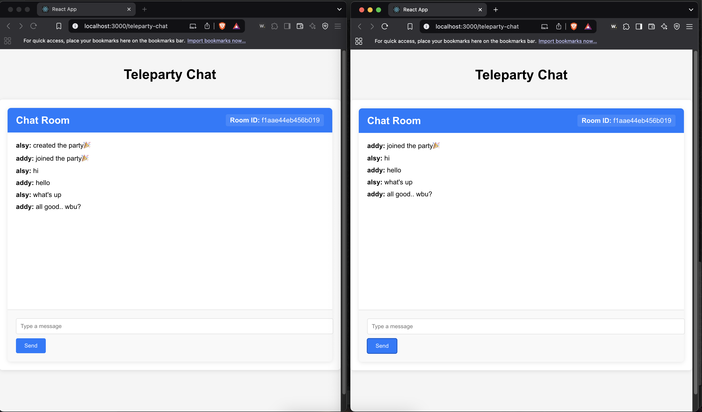

# Teleparty Chat Application

A simplified real-time chat application built using the `teleparty-websocket-lib` library. This application allows users to create chat rooms, join existing rooms, send messages, and view messages in real-time.



## Features

-   **Create Chat Rooms**: Users can create a new chat room with a unique ID.
-   **Join Chat Rooms**: Users can join an existing chat room using a room ID.
-   **Real-Time Messaging**: Send and receive messages in real-time using WebSockets.
-   **User Nickname**: Set a nickname when creating or joining a room.
-   **User Icon Upload**: Optionally upload a user icon to personalize your profile.
-   **Typing Indicators**: See when other users are typing in the chat room.
-   **Previous Messages**: Load all previous messages when joining a room.

## Technologies Used

-   **React**: Front-end library for building the user interface.
-   **TypeScript**: Adds static typing to JavaScript for better code quality.
-   **Teleparty WebSocket Library**: Handles WebSocket communication with the backend.
-   **GitHub Pages**: Hosts the deployed application.

## Getting Started

Follow these steps to set up and run the project locally.

### Prerequisites

-   Node.js (v16 or higher)
-   npm or yarn

### Installation

1. **Clone the repository**:

    ```bash
    git clone https://github.com/alsy99/teleparty-chat.git
    cd teleparty-chat
    ```

2. **Install dependencies**:

    ```bash
    npm install
    ```

3. **Start the development server**:

    ```bash
    npm run start
    ```

4. **Build the production version**:

    ```bash
    npm run build
    ```

5. **Deploy to GitHub Pages**:

    ```bash
    npm run deploy
    ```

6. **Access the application**:
   Open your browser and navigate to `https://alsy99.github.io/teleparty-chat/`.
